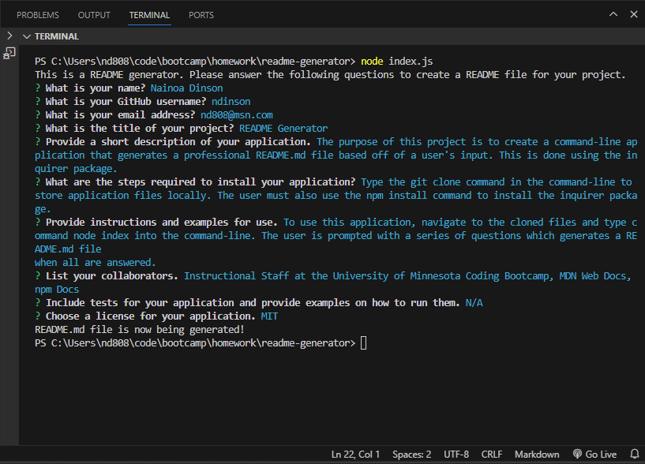
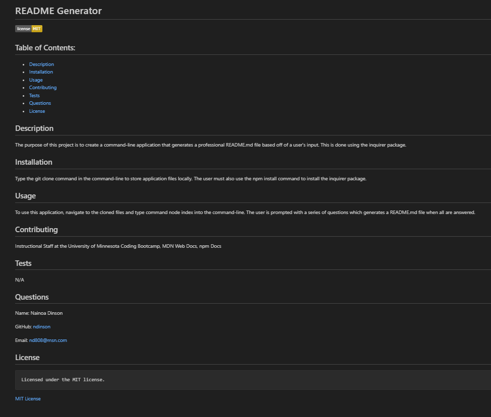

# readme-generator

## Description

The purpose of this project is to create a command-line application that generates a professional README.md file based off of a user's input. This is done using the inquirer package.

### Demo

## Installation

Type the git clone command in the command-line to store application files locally. The user must also use the npm install command to install the inquirer package.

## Usage

To use this application, navigate to the cloned files and type command node index into the command-line. The user is prompted with a series of questions which generates a README.md file when all are answered.

The following images show the appearance and functionality of the readme-generator:

## Credits

- Instructional Staff at the University of Minnesota Coding Bootcamp
- MDN Web Docs
- npm Docs

## Contact Information

Nainoa Dinson
  GitHub: [ndinson](https://github.com/ndinson)
 Email: [nd808@msn.com](mailto:nd808@msn.com)

## License

The MIT License (MIT)
Copyright © 2023 Nainoa Dinson

Permission is hereby granted, free of charge, to any person obtaining a copy of this software and associated documentation files (the “Software”), to deal in the Software without restriction, including without limitation the rights to use, copy, modify, merge, publish, distribute, sublicense, and/or sell copies of the Software, and to permit persons to whom the Software is furnished to do so, subject to the following conditions:

The above copyright notice and this permission notice shall be included in all copies or substantial portions of the Software.

THE SOFTWARE IS PROVIDED “AS IS”, WITHOUT WARRANTY OF ANY KIND, EXPRESS OR IMPLIED, INCLUDING BUT NOT LIMITED TO THE WARRANTIES OF MERCHANTABILITY, FITNESS FOR A PARTICULAR PURPOSE AND NONINFRINGEMENT. IN NO EVENT SHALL THE AUTHORS OR COPYRIGHT HOLDERS BE LIABLE FOR ANY CLAIM, DAMAGES OR OTHER LIABILITY, WHETHER IN AN ACTION OF CONTRACT, TORT OR OTHERWISE, ARISING FROM, OUT OF OR IN CONNECTION WITH THE SOFTWARE OR THE USE OR OTHER DEALINGS IN THE SOFTWARE.
